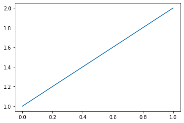

```python
#hide
%matplotlib inline
import pandas as pd
import matplotlib.pyplot as plt
```

Jupyter displays the result of the last line of a cell, so there's no need to include print(). (And including extra code that isn't needed means there's more cognitive overhead for the reader; so don't include code that you don't really need!)


```python
plt.plot([1,2]);
```





```python
pd.DataFrame({'a':[1,2], 'b':[3,4]})
```


<div>
<style scoped>
    .dataframe tbody tr th:only-of-type {
        vertical-align: middle;
    }

    .dataframe tbody tr th {
        vertical-align: top;
    }

    .dataframe thead th {
        text-align: right;
    }
</style>
<table border="1" class="dataframe">
  <thead>
    <tr style="text-align: right;">
      <th></th>
      <th>a</th>
      <th>b</th>
    </tr>
  </thead>
  <tbody>
    <tr>
      <th>0</th>
      <td>1</td>
      <td>3</td>
    </tr>
    <tr>
      <th>1</th>
      <td>2</td>
      <td>4</td>
    </tr>
  </tbody>
</table>
</div>


You can also paste images, such as screenshots, directly into a markdown cell in Jupyter. This creates a file embedded in the notebook that Jupyter calls an “attachment”. Or you can use Markdown to refer to an image on the internet by its URL.


```python

```
