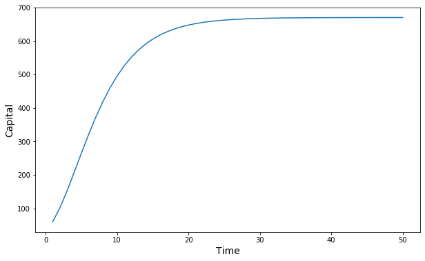

This post provides an example of the Solow growth model in the Black Rhino package. It will first cover the Solow model itself and how it is implemented in Black Rhino. Then, it will cover how to use Black Rhino to actually run the model and analyse the results.

## The model

The [Solow (1956)](https://www.jstor.org/stable/pdf/1884513.pdf) growth model is a model of long-run economic growth. The model contains a single equation that explains long-run economic growth as a function of capital accumulation, labour, and productivity.

$$Y(t) = K(t)^\alpha $$

The model is set within the framework of neoclassical economics. It is essentially a

It attempts to explain long-run economic growth by looking at capital accumulation, labor or population growth, and increases in productivity, commonly referred to as technological progress. At its core is a neoclassical (aggregate) production function, often specified to be of Cobb–Douglas type, which enables the model "to make contact with microeconomics".[1]:26 The model was developed independently by Robert Solow and Trevor Swan in 1956,[2][3][note 1] and superseded the Keynesian Harrod–Domar model. $$\beta$$

## Configuring the model

In the Black Rhino framework, parameters are stored in xml files. Using this notebook, you can set change them. First, you need to import the elementree from the xml Python module.

```python
import xml.etree.ElementTree as ET
```

Below you will find the parameter inputs for this model.  

```python
parameter_values = (('num_sweeps', '30'),
                    ('num_simulations', '1'),
                    ('num_banks', '1'),
                    ('num_firms', '1'),
                    ('num_households', '1'),
                    ('bank_directory', 'agents/banks/'),
                    ('firm_directory', 'agents/firms/'),
                    ('household_directory', 'agents/households'),
                    ('measurement_config', 'measurements/test_output.xml')
                   )
```

To translate this to an xml document, which the framework can read, we first need create an ET element.

```python
environment = ET.Element('environment')
```

And create parameter elements and give them the values seen below to add to the tree object.


```python
parameters = []
for x in range(len(parameter_values)):
    parameters.append(ET.SubElement(environment, 'parameter'))

for idx, p in enumerate(parameters):
    p.set('type', 'static')
    p.set('name', parameter_values[idx][0])
    p.set('value', parameter_values[idx][1])
```

This object can now be transformed to a string and written to an xml file using the code below.

```python
xml_params = ET.tostring(environment, encoding="unicode")
myfile = open("environments/solow_parameters.xml", "w")
myfile.write(xml_params)
myfile.close()
```

Now, the parameter xml file has been generated and the model can be run. Before, running the model, you need to import a couple of extra modules. These are the Python logging module, the Black Rhino environment class, and the Black Rhino runner class.

```python
import logging
import os
from src.environment import Environment
from src.runner import Runner
```

Then, before running the model, the logger needs to be initialized.

```python
log_directory = "log/"
identifier = "test_all_methods"
environment_directory = "environments/"
if not os.path.exists('log'):
    os.makedirs('log')
logging.basicConfig(format='%(asctime)s %(message)s', datefmt='%m/%d/%Y %H:%M:%S',
                    filename=log_directory + identifier + ".log", level=logging.INFO)
logging.info('START logging for run: %s',  environment_directory + identifier + ".xml")
```

First, the environment will be initialized. It contains the model parameters and variables. The environment also contains a list of agents. In the Solow model, the environment contains one bank, one firm, and one household. Finally, it also contains initialized transactions for these agents.

```python
environment = Environment(environment_directory, identifier)
```

Next up, the runner object is created. As the name suggests, the runner object handles the running of the model. But that is not all, it also initializes the updater.

```python
runner = Runner(environment)
```

Now you can actually run the model. Since the agent-based model is simulated using Monte Carlo methods. This means that the model will be run multiple times (num_simulations). For every simulation run, the environment and runner will be (re-)initialized. Then, the runner will run the Solow model. During the run, the runner will write data about capital to a csv file specified within the Measurement class and print out all the transactions happening and the books of firm and household at the end of each sweep.


```python
for i in range(int(environment.num_simulations)):
    logging.info('  STARTED with run %s',  str(i))
    environment.initialize(environment_directory,  identifier)
    runner.initialize(environment)

    runner.do_run(environment)
    logging.info('  DONE')
```

So, now the model has been run, you will be able to analyse its outputs. If you are running the Ipython notebook to run the model. The following command will set the notebook to depict the output inside the notebook.


```python
%matplotlib inline
```

Furthermore, you should import the modules to create graphs (matplotlib) and data frames (pandas).


```python
import pandas as pd
import matplotlib.pyplot as plt
```

Running the model has generated a csv file that contains its output. We can use pandas to read the csv.


```python
solow_data = pd.read_csv('measurements/TestMeasurement.csv', index_col=0)
```

The datafame looks as follows:


```python
solow_data.head(3)
```

<div>
<style scoped>
    .dataframe tbody tr th:only-of-type {
        vertical-align: middle;
    }

    .dataframe tbody tr th {
        vertical-align: top;
    }

    .dataframe thead th {
        text-align: right;
    }
</style>
<table border="1" class="dataframe">
  <thead>
    <tr style="text-align: right;">
      <th></th>
      <th>Deposits</th>
    </tr>
    <tr>
      <th>Step</th>
      <th></th>
    </tr>
  </thead>
  <tbody>
    <tr>
      <th>1</th>
      <td>60.105832</td>
    </tr>
    <tr>
      <th>2</th>
      <td>101.668774</td>
    </tr>
    <tr>
      <th>3</th>
      <td>152.021609</td>
    </tr>
  </tbody>
</table>
</div>


The Solow growth model is expected to produce an increase in total wealth that slows over time. In this version of the model, this means that there is deposit growth until the equilibrium is reached. This is exactly what we observe.


```python
fig, ax = plt.subplots(nrows=1, ncols=1, figsize=(10,6))

ax.plot(solow_data.index, solow_data)
ax.set_xlabel('Time', fontsize='14')
ax.set_ylabel('Capital', fontsize='14')

fig.savefig('solow_capital.png')
```



This was an example of how to run one configuration of this model. The Black Rhino examples/solow folder contains three seperate notebooks for each of the elements of configuring the model, running the model, and analysing the results. For more advanced use, we recommend using these notebooks to run the model.
